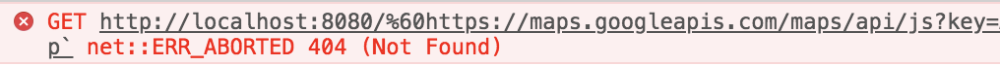

By Ben Kirby, Paige Williams, Phil Mass, and Tanvi Garg

We are students at [Epicodus](https://www.epicodus.com/), a code school in Portland, Or.

We wanted to incorporate Google Maps into one of our projects using Webpack to sharpen our async skills. We came across some issues and had trouble finding documentation that showed a similar use case. Our simple project structure looked like this:

```
|- .env
|- .gitignore
|- package.json
|- webpack.config.js
|- src 
   - index.html
   - main.js
   - map.js
   - styles.css
```
We use [dotenv-webpack](https://www.npmjs.com/package/dotenv-webpack) to protect our API key and include .env in our .gitignore file so that it is never committed to a repository. [Google’s single-page example](https://developers.google.com/maps/documentation/javascript/examples/map-simple) is helpful in understanding the basic structure of a Google Maps object, but it does not provide documentation on how to implement it in a more complex webpack application structure.

After attempting to implement Google’s example in our webpack application by adding the Google Maps script into our map.js file, we received the following error:



We needed to find a way to load the Google Maps API without the global callback in the HTML while still keeping out API keys hidden. Our search led us to the handy NPM package [load-google-maps-api](https://www.npmjs.com/package/load-google-maps-api).

## Implementation

This is how we implemented it into our project:

To install the package with NPM, run:

```
npm install --save load-google-maps-api

```
In your HTML add a div where the map will reside.

```html
<div id="map"></div>

```
Give your map a size in your CSS file.

```css
#map {
  width: 500px;
  height: 500px;
}

```
Require the NPM package in map.js and write a function to load the Google Maps API. You supply the API key as an object literal.
```javascript
const loadGoogleMapsApi = require('load-google-maps-api');
class Map {
  
  static loadGoogleMapsApi() {
    return loadGoogleMapsApi({ key: process.env.GOOGLEMAPS_KEY });
  }
  static createMap(googleMaps, mapElement) {
    return new googleMaps.Map(mapElement, {
      center: { lat: 45.520562, lng: -122.677438 },
      zoom: 14
    });
  }
}
export { Map };
```
We also added a function to create the map object. Which we will get to in our next snippet.

In the main.js :
```javascript
import { Map } from './map';
import './styles.css';
document.addEventListener("DOMContentLoaded", function() {
  let mapElement = document.getElementById('map');
  
  Map.loadGoogleMapsApi().then(function(googleMaps) {
    Map.createMap(googleMaps, mapElement);
  });
});
```
This is basically how it works! We call the loadGoogleMapsAPI function which returns a promise. When the promise resolves, it returns an object that is the equivalent of google.map in the google maps API documentation. You can use the returned object to make the createMap function call.

Here’s a [link](https://github.com/philrmass/minimal-google-maps-api) to a repo with the minimal google maps setup. To build it:

Clone to a local directory
  1. Run npm install
  2. Run npm run build and check there are no errors
  3. Run npm run start or npm run winstart if you’re on windows
  4. It should open a tab in your browser at localhost:8000

## Conclusion

We liked this package specifically because of how clean it was and how simple it was to implement within our existing code. Additionally, it allowed us to utilize the rest of the Google Maps features alongside the package seamlessly.

Happy coding!